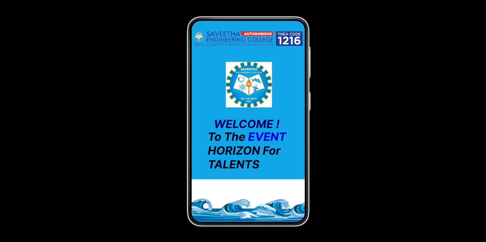
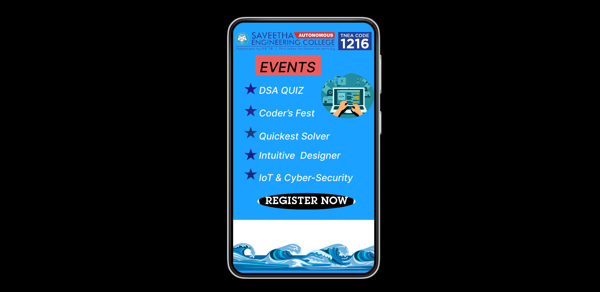
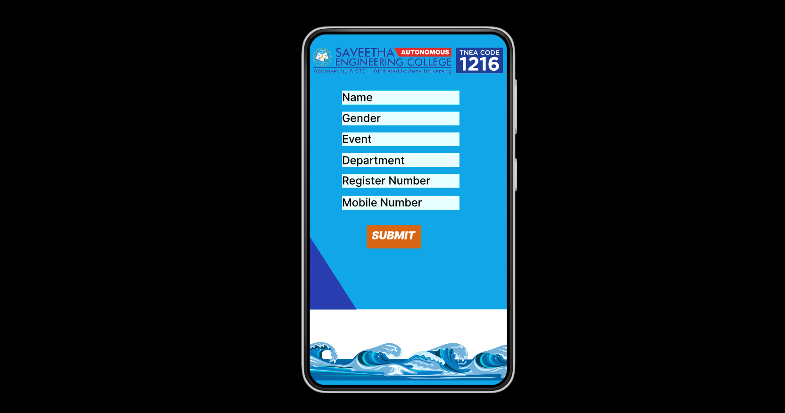

# Ex09 Event Registration Web Application
## Date: 29-04-2024

## AIM:
To design, develop and deploy a web application for event registration.

## DESIGN STEPS:

### Step 1:
Create a new frame.

### Step 2:
Select any one preset size of your choice.

### Step 3:
Select the shapes you need.

### Step 4:
Import images as needed.

### Step 5:
Create pages based on your need and link them.

### Step 6:

Validate the HTML and CSS code.

### Step 6:

Publish the website in the given URL.

## DESIGN TOOL:
Figma

## CODE:
Android Page-1
```
<div style="width: 360px; height: 640px; position: relative; background: #10A6E7">
  <div style="width: 216px; height: 62px; left: 71px; top: 306px; position: absolute; mix-blend-mode: color-burn; color: #DA2828; font-size: 36px; font-family: Inter; font-style: italic; font-weight: 700; word-wrap: break-word">WELCOME !</div>
  
  <div style="width: 258px; height: 141px; left: 51px; top: 347px; position: absolute"><span style="color: #3B6031; font-size: 36px; font-family: Inter; font-style: italic; font-weight: 700; word-wrap: break-word">To The </span><span style="color: #0C40F6; font-size: 36px; font-family: Inter; font-style: italic; font-weight: 700; word-wrap: break-word">EVENT</span><span style="color: #3B6031; font-size: 36px; font-family: Inter; font-style: italic; font-weight: 700; word-wrap: break-word"> HORIZON For TALENTS </span></div>
  
  
</div>
```

Android Page -2
```
<div style="width: 360px; height: 640px; position: relative; background: #1BA1FF">
  
  
  <div style="width: 167px; height: 53px; left: 57px; top: 83px; position: absolute; background: #EC5E5E"></div>
  <div style="width: 148px; height: 37px; left: 68px; top: 92px; position: absolute; color: black; font-size: 36px; font-family: Inter; font-style: italic; font-weight: 500; word-wrap: break-word">EVENTS</div>
  <div style="width: 261px; height: 28px; left: 66px; top: 159px; position: absolute; color: white; font-size: 24px; font-family: Inter; font-style: italic; font-weight: 500; word-wrap: break-word">DSA QUIZ</div>
  <div style="width: 261px; height: 28px; left: 66px; top: 276px; position: absolute; color: white; font-size: 24px; font-family: Inter; font-style: italic; font-weight: 500; word-wrap: break-word">Quickest Solver</div>
  <div style="width: 261px; height: 28px; left: 66px; top: 325px; position: absolute; color: white; font-size: 24px; font-family: Inter; font-style: italic; font-weight: 500; word-wrap: break-word">Intuitive  Designer</div>
  <div style="width: 261px; height: 28px; left: 66px; top: 382px; position: absolute; color: white; font-size: 24px; font-family: Inter; font-style: italic; font-weight: 500; word-wrap: break-word">IoT & Cyber-Security </div>
  <div style="width: 261px; height: 28px; left: 66px; top: 217px; position: absolute; color: white; font-size: 24px; font-family: Inter; font-style: italic; font-weight: 500; word-wrap: break-word">Coder’s Fest</div>
  
  
</div>
```

Android Page -3:
```
<div style="width: 360px; height: 640px; position: relative; background: #10A6E7">
  
  
  <div style="width: 214px; height: 25px; left: 59px; top: 103px; position: absolute; background: #D9D9D9"></div>
  <div style="width: 214px; height: 25px; left: 59px; top: 295px; position: absolute; background: #D9D9D9"></div>
  <div style="width: 214px; height: 25px; left: 59px; top: 255px; position: absolute; background: #D9D9D9"></div>
  <div style="width: 214px; height: 25px; left: 59px; top: 217px; position: absolute; background: #D9D9D9"></div>
  <div style="width: 214px; height: 25px; left: 59px; top: 179px; position: absolute; background: #D9D9D9"></div>
  <div style="width: 214px; height: 25px; left: 59px; top: 141px; position: absolute; background: #D9D9D9"></div>
  <div style="width: 69px; height: 25px; left: 59px; top: 103px; position: absolute; color: black; font-size: 20px; font-family: Inter; font-weight: 500; word-wrap: break-word">Name</div>
  <div style="width: 161px; height: 25px; left: 59px; top: 295px; position: absolute; color: black; font-size: 20px; font-family: Inter; font-weight: 500; word-wrap: break-word">Mobile Number</div>
  <div style="width: 189px; height: 25px; left: 59px; top: 255px; position: absolute; color: black; font-size: 20px; font-family: Inter; font-weight: 500; word-wrap: break-word">Register Number</div>
  <div style="width: 163px; height: 25px; left: 59px; top: 218px; position: absolute; color: black; font-size: 20px; font-family: Inter; font-weight: 500; word-wrap: break-word">Department</div>
  <div style="width: 69px; height: 25px; left: 59px; top: 179px; position: absolute; color: black; font-size: 20px; font-family: Inter; font-weight: 500; word-wrap: break-word">Event</div>
  <div style="width: 107px; height: 25px; left: 59px; top: 141px; position: absolute; color: black; font-size: 20px; font-family: Inter; font-weight: 500; word-wrap: break-word">Gender</div>
  <div style="width: 99px; height: 43px; left: 104px; top: 348px; position: absolute; background: #D76615"></div>
  <div style="width: 147px; height: 30px; left: 113px; top: 355px; position: absolute; color: white; font-size: 20px; font-family: Inter; font-style: italic; font-weight: 900; word-wrap: break-word">SUBMIT</div>
</div>
```

## OUTPUT:




## RESULT:
The program to design, develop and deploy a web application for event registration is completed successfully.
